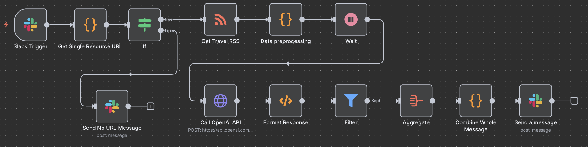

# Travel-News-Automation-Agent

This project is an automated agent that uses n8n and OpenAI's GPT model to process news content. It fetches the latest articles from a specified RSS Feed, uses AI to summarize and categorize them, and pushes the most relevant content directly to a Slack channel.

---

## Core Features

* **Automated News Fetching**: Periodically retrieves articles from an RSS Feed.

* **AI Content Analysis**: Uses GPT to generate summaries, extract key insights, and assign scores and categories.

* **Smart Filtering**: Filters articles based on custom criteria such as category and relevance score.

* **Instant Notifications**: Delivers processed content in a clear format to a Slack channel.

---

## Prerequisites

Before deploying this workflow, you will need the following items:

* An n8n instance.

* An OpenAI API key.

* A Slack Webhook URL or an OAuth2 app with the correct permissions.

---

## Deployment and Setup Guide

1.  **Import the Workflow**: Download the `workflow.json` file from this repository. In your n8n instance, select **Import from JSON** and upload the file.

2.  **Update Credentials**:
    * Open the `Call GPT API` node. In the **Headers** section, replace `Authorization: Bearer [Enter your OpenAI key]` with your own OpenAI API key.
    * For the Slack nodes, refer to our [Slack Credential Setup](https://youtu.be/qk5JH6ImK0I?si=vrtaWDmuEmGSCuu3) guide for instructions on correctly configuring OAuth2 credentials.

3.  **Activate and Run**:
    * Save and activate the workflow in n8n.
    * You can either run it manually or set up a timed trigger for full automation.
    
* **For more information, here is my Notion as a documentation for architecture decisions and setup instructions**: <https://www.notion.so/Travel-News-Automation-Agent-242fe959675180ebb455fe3d63c6c04f?source=copy_link>

---

## Project Architecture

The project's architecture is built on a clear, sequential workflow:

---

## Reference

* **Video Guide for n8n Slack OAuth2 Credentials**: <https://youtu.be/qk5JH6ImK0I?si=vrtaWDmuEmGSCuu3>

